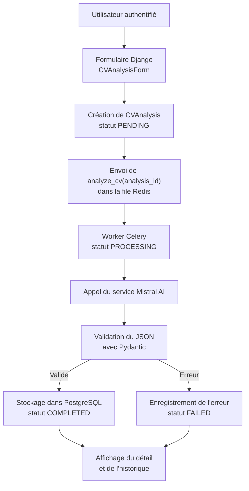
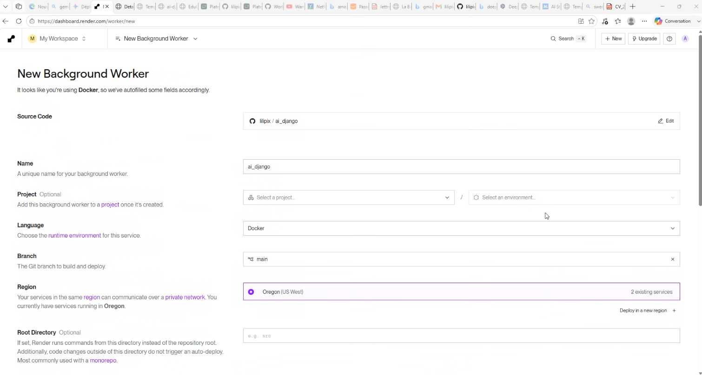
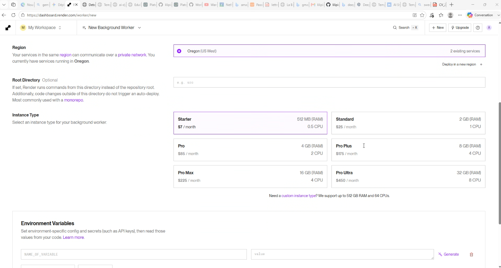

# IA - Analyse de CV avec Django et Mistral AI

          

## Membres du groupe

- Dina CHAOUKI
- Cécile Audrée DEMEUNI
- Aurélie DEMURE

## Déploiement

URL de l'application en ligne :

[https://ai-django-cpdi.onrender.com/](https://ai-django-cpdi.onrender.com/)

> **Attention :** lire la section [Difficulté rencontrée lors du déploiement](#difficulté-rencontrée-lors-du-déploiement) avant de tester l'analyse IA en ligne.

## Présentation du projet

Le projet consiste à créer une application Django permettant à un utilisateur authentifié de coller le texte de son CV, puis de recevoir une analyse structurée produite par une IA.

Cas d'usage IA retenu : **analyse et amélioration de CV**.

L'application doit retourner :

- un score global sur 100 ;
- des sous-scores selon une grille précise ;
- les points forts du CV ;
- les points faibles avec explications ;
- des recommandations concrètes ;
- des propositions pour les sections à améliorer ;
- un historique des analyses de l'utilisateur.

## Guide d'exécution locale

### Prérequis

- Docker ;
- Docker Compose ;
- une clé API Mistral AI.

### Configuration

Créer un fichier `.env` à partir du fichier fourni et renseigner les valeurs dans `.env`

```bash
cp .env.example .env
```

La clé `MISTRAL_API_KEY` ne doit jamais être committée.

### Lancement avec Docker Compose

Lancer l'application :

```bash
docker compose up --build
```

Services lancés :

- `web` : application Django ;
- `worker` : worker Celery chargé d'exécuter les analyses IA ;
- `redis` : broker Celery ;
- `db` : base PostgreSQL.

L'application est accessible localement sur :

```text
http://localhost:8000
```

### Commandes utiles hors Docker

Installer les dépendances avec uv :

```bash
uv sync
```

Lancer les migrations :

```bash
uv run python manage.py migrate
```

Lancer Django :

```bash
uv run python manage.py runserver
```

Lancer un worker Celery :

```bash
uv run celery -A config worker --loglevel=info
```

Lancer les vérifications :

```bash
uv run ruff check .
uv run python manage.py check
```

## Architecture technique et pipeline IA

### Flux de données



### Composants principaux

- `cv_analyzer/models.py` : modèle ORM `CVAnalysis` ;
- `cv_analyzer/forms.py` : formulaire Django `CVAnalysisForm` ;
- `cv_analyzer/views.py` : vues d'historique, détail et création d'analyse ;
- `cv_analyzer/tasks.py` : tâche Celery `analyze_cv` ;
- `cv_analyzer/services/mistral_service.py` : appel au fournisseur IA Mistral ;
- `cv_analyzer/validation.py` : validation Pydantic du JSON IA ;
- `config/celery.py` : configuration Celery ;
- `docker-compose.yml` : orchestration Django, worker, Redis et PostgreSQL.

### Pipeline IA

1. L'utilisateur colle le texte de son CV dans un formulaire.
2. Django valide le champ `cv_text` via `CVAnalysisForm`.
3. Une ligne `CVAnalysis` est créée en base avec le statut `PENDING`.
4. Django envoie la tâche Celery `analyze_cv(analysis_id)` dans la file Redis.
5. Le worker Celery récupère la tâche depuis Redis, charge l'analyse en base et passe le statut à `PROCESSING`.
6. Le service Mistral construit un prompt avec la grille de notation.
7. Mistral retourne une réponse JSON structurée.
8. Pydantic valide la structure, les types, les bornes et la cohérence du score.
9. Le résultat validé est stocké dans `CVAnalysis.result`.
10. L'analyse passe en `COMPLETED`, ou en `FAILED` en cas d'erreur.

### Contraintes imposées au modèle IA

Le prompt demande explicitement au modèle de ne jamais inventer :

- d'expérience ;
- de diplôme ;
- de compétence ;
- de résultat chiffré ;
- d'information personnelle absente du CV.

### Grille de notation

Le score total est sur 100 points :

- structure et lisibilité : 20 points ;
- clarté des expériences : 20 points ;
- mise en valeur de l'impact : 20 points ;
- pertinence des compétences : 15 points ;
- qualité rédactionnelle : 15 points ;
- complétude des rubriques : 10 points.

## Modèle ORM

### Entités principales

```text
User
 |
 | 1,n
 v
CVAnalysis
```

### Diagramme ERD

```text
+---------------------------+        +-----------------------------+
| auth.User                 |        | cv_analyzer.CVAnalysis      |
+---------------------------+        +-----------------------------+
| id                        |<------ | user_id                     |
| username                  |        | id                          |
| email                     |        | cv_text                     |
| password                  |        | status                      |
+---------------------------+        | result JSON                 |
                                     | error_message               |
                                     | created_at                  |
                                     | updated_at                  |
                                     | completed_at                |
                                     +-----------------------------+
```

Relation :

- un utilisateur peut avoir plusieurs analyses ;
- une analyse appartient à un seul utilisateur ;
- le `related_name` est `cv_analyses`.

## Choix UI/UX et gestion du temps d'inférence

Les templates Django mettent en place une interface simple centrée sur le suivi de
l'analyse IA.

### Design system et tokens

Les variables CSS sont centralisées dans `cv_analyzer/templates/base.html` avec des tokens pour :

- les couleurs principales (`--bg`, `--panel`, `--text`, `--brand`, `--accent`) ;
- les couleurs d'état (`--ok`, `--warn`, `--bad`) ;
- les bordures et séparateurs (`--line`) ;
- les rayons (`--radius`) ;
- les ombres (`--shadow`) ;
- la typographie (`Outfit` et `IBM Plex Mono`).

### Retours d'état pendant l'inférence

Côté backend, la latence de l'IA est gérée avec des statuts persistants :

- `PENDING` : analyse créée mais pas encore traitée ;
- `PROCESSING` : analyse en cours dans le worker Celery ;
- `COMPLETED` : résultat disponible ;
- `FAILED` : erreur lors du traitement.

Ces statuts permettent au template de proposer des retours visuels adaptés :

- message d'attente pendant `PENDING` ou `PROCESSING` ;
- loader circulaire pendant l'analyse ;
- skeletons de chargement pour suggérer la structure du résultat à venir ;
- affichage du score et des recommandations en `COMPLETED` ;
- affichage d'un message d'erreur en `FAILED`.

Dans `analysis_detail.html`, la page se rafraîchit automatiquement toutes les 5 secondes tant que l'analyse est en statut `PENDING` ou `PROCESSING`. Cela permet à l'utilisateur de voir le résultat dès que le worker Celery termine le traitement.

### Affichage réactif

Le choix retenu est un traitement asynchrone complet : l'utilisateur voit un état d'attente, puis la page affiche le résultat structuré lorsque l'analyse passe en `COMPLETED`.

### Gestion des erreurs IA

Les erreurs sont affichées avec des messages explicites :

- erreurs de formulaire lorsque le CV est vide ou trop court ;
- message d'erreur si le lancement de la tâche Celery échoue ;
- affichage de `analysis.error_message` lorsque l'analyse passe en statut `FAILED`.

Les dépassements de quota API ne sont pas encore distingués par un message dédié :
ils sont actuellement traités comme des échecs d'analyse. Une amélioration future
consiste à détecter spécifiquement ce cas pour afficher un message plus précis.

## Rapport d'ingénierie et post-mortem

### Performances du modèle

Le modèle Mistral est utilisé pour produire une analyse qualitative structurée.
Le backend impose une grille de notation et valide le JSON avant stockage, afin de
limiter les réponses incomplètes ou incohérentes.
La température du modèle est fixée à `0.2` afin de privilégier des réponses stables, factuelles et peu créatives, ce qui réduit le risque d'invention d'informations dans le contexte d'une analyse de CV.

Limite identifiée : le modèle peut formuler des recommandations subjectives. Pour
réduire ce risque, le prompt lui interdit explicitement d'inventer des expériences, compétences, diplômes ou données chiffrées absentes du CV.

### Gestion des coûts et quotas API

Chaque analyse déclenche un appel à l’API Mistral exécuté en arrière-plan par un worker Celery. Redis met les tâches en attente lorsque le worker n’est pas immédiatement disponible, mais ne réduit pas directement le coût des appels à l’API.
La clé API est lue depuis `MISTRAL_API_KEY`.

Plusieurs mesures permettent de contrôler la consommation :

- le modèle `mistral-small-latest` est privilégié, car il présente un compromis adapté entre coût, rapidité et qualité pour une analyse de CV ;
- le modèle est défini avec la variable `MISTRAL_MODEL`, ce qui permet de le remplacer sans modifier le code ;
- le paramètre `max_tokens=2500` limite la longueur maximale de la réponse générée ;
- seul le texte collé par l'utilisateur dans le champ CV est envoyé au modèle ;
- la validation du formulaire empêche l’envoi de contenus vides ou trop courts ;
- chaque appel est associé à une analyse enregistrée en base afin d’en conserver le statut ;
- les statuts `PENDING`, `PROCESSING`, `COMPLETED` et `FAILED` permettent de suivre le traitement et d'éviter qu'une tâche déjà commencée soit retraitée ;
- un délai maximal, défini par `MISTRAL_TIMEOUT_MS`, empêche une requête de rester bloquée indéfiniment ;
- la consommation et les quotas doivent être régulièrement contrôlés depuis la console Mistral.

Améliorations futures :

- éviter les relances multiples d'une même analyse ;
- limiter la taille maximale du CV si nécessaire ;
- enregistrer le nombre de tokens consommés et estimer le coût de chaque analyse ;
- limiter le nombre d'analyses par utilisateur et par jour ;
- afficher un message spécifique lorsque le quota de l'API est atteint.

### Difficultés techniques résolues

- séparation entre interface Django et traitement long via Celery ;
- stockage du résultat IA en JSON validé dans PostgreSQL ;
- validation stricte du schéma avec Pydantic ;
- ajout d'un worker Celery dans Docker Compose ;
- protection de l'historique utilisateur par filtrage sur `request.user` ;

### Difficulté rencontrée lors du déploiement

L’interface Django a bien été déployée sur Render, mais pas le traitement asynchrone des analyses. En local, un worker Celery récupère les tâches et appelle l’API Mistral. Sur Render, ce worker nécessite un service payant.

Sans worker, les analyses restent donc au statut PENDING. Une solution envisagée consiste à les exécuter directement dans le service web, mais cela peut ralentir l’application ou provoquer un dépassement du délai d’exécution.

## Captures d'écran





## Licence

Projet réalisé dans un cadre pédagogique.
